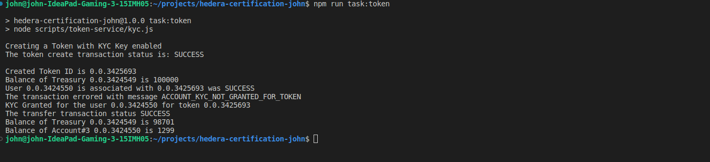
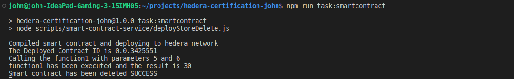
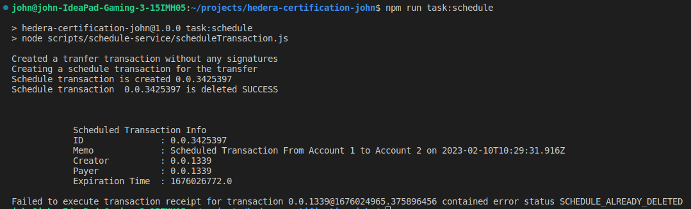
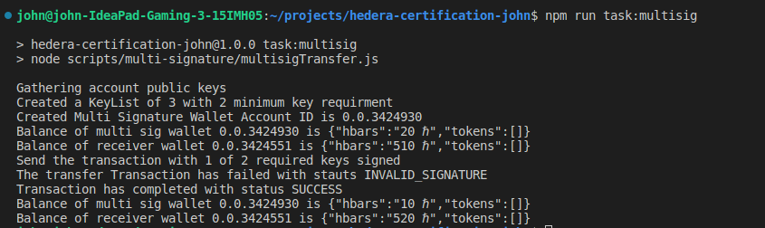
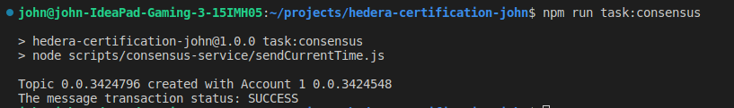

# Hedera Certification - John Jayasingh

Follow the below steps to setup the codebase 

1. Clone the repo `git clone https://github.com/johnjayasingh/hedera-certification-john.git`
2. Run `npm install` to install the dependency
3. After installing the dependencies we will need to configure the credentials and test accounts
4. First create a copy of `sample.env` and name it `.env`
5. In the .env update all the values as per the requirment
```
SEED_COUNT= # the no of accounts to be generated
SEED_AMOUNT = # the amount hbar to be deposited as initial balance for seed accounts
CLIENT_ID = # account id to be used for transactions such as creating seed account or paying transaction fee to some transactions used in scripts
CLIENT_PRIVATE_KEY = # private key of the client_id/account id used in previous line
```
6. After setting up the values run `npm run seed` to create test accounts based of number given. The accounts are stored under `config/acccounts.json` file in JSON format 
7. If you want to recreate new accounts simply running this command again will clear old accounts and create new accounts.
8. After setting up all the required we can run tasks one by one with the help of `npm scripts`. To do so follow steps further in below sections.

Below tasks are included with steps to run and output received at the time of execution and info on what happens inside the code 

## Task 1 - Token Service
Create a script that generates a fungible token that requires a KYC
process to be completed.

Set a fixed supply of 1000. Associate Account3, but do not KYC it.
Try to send 12.99 tokens from Account2 to Account3.

Show that the account is not yet able to participate in the token
because it is not been KYC approved.

Now set the KYC flag on Account3 and retry the transfer.

### Steps
1. To run token kyc service `npm run task:token`
2. The script creates a token with KYC enabled and fixed supply 
3. We will try to transfer from treasurry to account#3 without doing KYC first and the transaction fails
4. Then using kyc key we will do KYC verification for the account#3
5. Post KYC script will do the transfer again and the transfer goes through 


### Output



## Task 2 - Smart Contract Service
Compile the Solidity contract given below using
Account1 and deploy it to the Hedera Network using
the HCS with the ContractCreateFlow method. 

Write a script to call “function1” with the parameters 5 and 6.
Gather the result and display it in the output.

Delete the smart contract.
### Steps
1. To run schedule service `npm run task:smartcontract`
2. First the solidity smart contract is compiled to bytecode with solc library 
3. Then the bytecode is used to create a smart contract instance on Hedera network
4. After contract is creation a transaction to set values is executed and result is printed
5. Finally the contract that is created gets delted with the use of admin key and any funds locked in contract is transferred to the obtainer


### Output



## Task 3 - Scheduled Transaction
Create a script that creates a scheduled transaction of 2 hbar from
Account1 to Account2.

Make a second script that deletes the transaction.

Print out the schedule information along the way along with the
proof that the transfer did not happen.

Try to execute the transaction and show that it does not work.

### Steps
1. To run schedule service `npm run task:schedule`
2. The script will create a transfer transaction without getting signatures and schedule it 
3. We will delete the schedule transaction with the admin key
4. After deletion will see if the expiration time is set properly with printing info
4. Finally we will verify the deleted schedule transaction can be executed with valid signatures  


### Output



## Task 4 - Multi Signature

Create a scheduled transaction with a key list with 3 key
(Account1, Account2 and Account3) that requires 2 of the three
keys.

Sign the transaction with Account1. Get the information of the
transaction and show that it has not yet been executed.

Sign the transaction with Account2 and get the information again to show that it has been executed.


### Steps
1. To run consensus service `npm run task:multisig`
2. The script will collect the required keys and will create a multi sig wallet with an inital balance
3. After which at it will try to do transaction with just 1 out of 2 required keys and the transaction fails
4. Post the failed transaction we will try again with a new transaction with 2 of 2 required keys and the transaction succeds


### Output



## Task: 5 - Consensus Service
Create a script to create a consensus transaction on the Hedera
Consensus Service using Account1. Write the current time in the
message of the transaction and submit.

### Steps
1. To run consensus service `npm run task:consensus`
2. After running there will a new topic created
3. After which the subscription to topic starts
4. As soon a message is sent to the topic it is listened and printed in output

### Output


---
