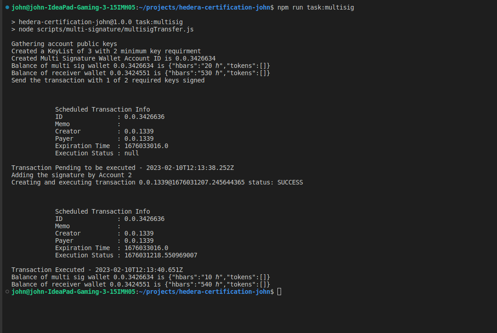

# Hedera Certification - John Jayasingh

Follow the below steps to setup the codebase 

1. Clone the repo `git clone https://github.com/johnjayasingh/hedera-mock.git`
2. Run `npm install` to install the dependency

## Task 4 - Multi Signature

Create a scheduled transaction with a key list with 3 key
(Account1, Account2 and Account3) that requires 2 of the three
keys.

Sign the transaction with Account1. Get the information of the
transaction and show that it has not yet been executed.

Sign the transaction with Account2 and get the information again to show that it has been executed.

### Steps
1. To run consensus service `npm run task:multisig`
2. The script will collect the required keys and will create a multi sig wallet with an inital balance
3. After which at it will try to do transaction with just 1 out of 2 required keys and the transaction fails
4. Post the failed transaction we will try again with a new transaction with 2 of 2 required keys and the transaction succeds

### Output

## Task: 5 - Consensus Service
Create a script to create a consensus transaction on the Hedera
Consensus Service using Account1. Write the current time in the
message of the transaction and submit.

### Steps
1. To run consensus service `npm run task:consensus`
2. After running there will a new topic created
3. After which the subscription to topic starts
4. As soon a message is sent to the topic it is listened and printed in output

### Output

---
